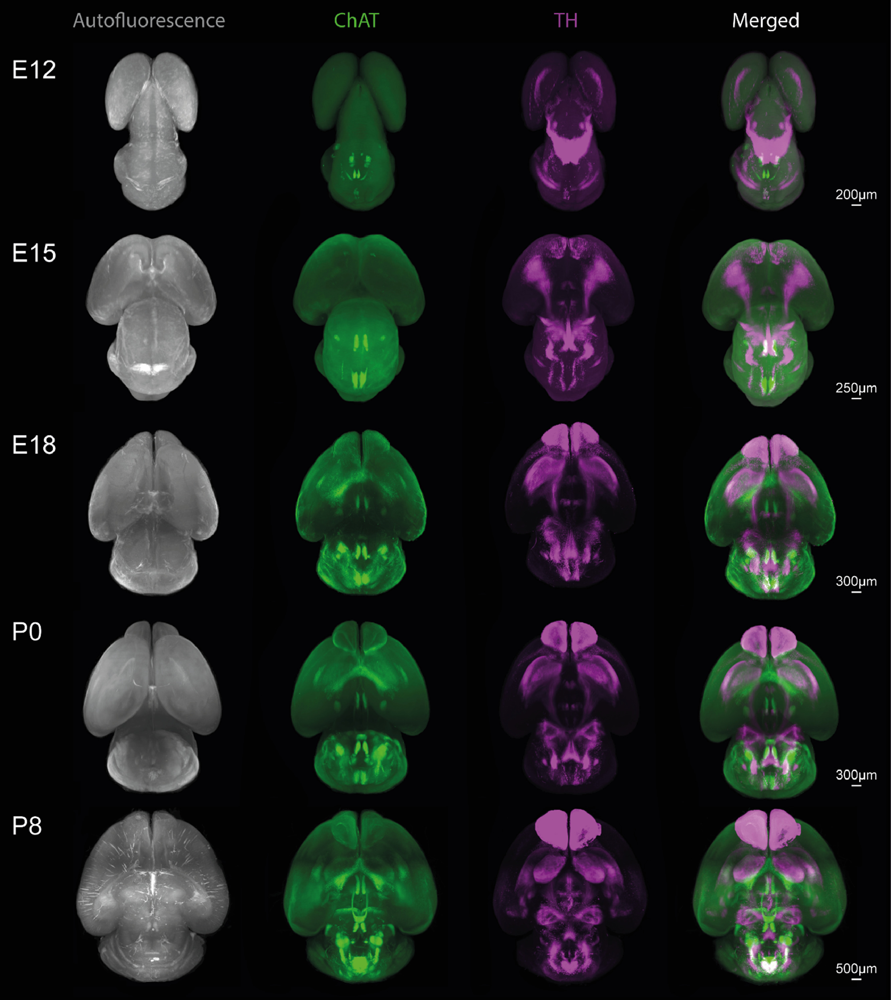
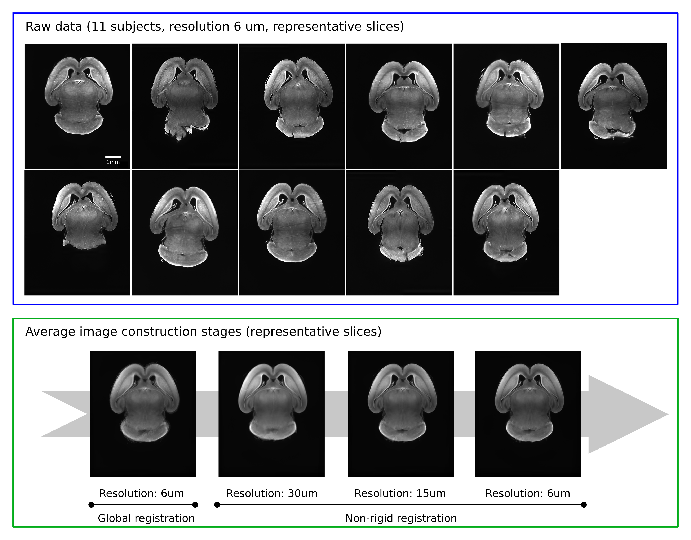

{}
The atlas is available in [_B&A Biomedical website_](https://www.babiomedical.com/projects/iben-atlas/).
{}

  

    

      
📝

      
Overview

    

    

        This project developed a high-resolution 3D atlas of cholinergic and catecholaminergic systems in the mouse brain spanning embryonic to postnatal stages. My contribution focused on the atlas creation pipeline, which involved building population-averaged brain templates using advanced image processing and registration methods.
        <figure>
          
          <figcaption style="color:#006400;">
            Brain average template of ChAT and TH brain structures across development. Generation of a brain template based on the Light Sheet Fluorescence Microscopy (LSFM) fluorescence volume using an iterative registration and average processing.
          </figcaption>
        </figure>
    

  

  

    

      
🛠️

      
Tech Stack

    

    

        <ul>
            <li><b>Image preprocessing:</b> intensity normalization, noise reduction, resampling</li>
            <li><b>Registration framework:</b> Elastix toolbox for rigid, affine, and non-linear transformations</li>
            <li><b>Atlas generation:</b> multi-resolution groupwise registration to create unbiased average templates</li>
            <li><b>Data format & visualization:</b> 3D volumetric images with alignment to common coordinate space</li>
        </ul>
        <b>Tools:</b>
        <ul>
            <li>ImageJ</li>
            <li>Elastix toolbox</li>
            <li>Python packages: SimpleITK, tifffile, NumPy, SciPy</li>
        </ul>
        iBen atlas has been produced by following a multiresolution and iterative registration process of autofluorescence images. The complete pipeline is available on the <a href="https://github.com/iBen-foundation/iBen-atlas" target="_blank" style="color: blue;"><strong>IBen GitHub repository</strong></a>.
        
    

  

  

    

      
🔒

      
Challenge

    

    

        Brain imaging data at different developmental stages suffer from:
        <ul>
          <li>High variability in size and morphology</li>
          <li>Differences in contrast and resolution across modalities</li>
          <li>Need for unbiased group averages rather than biased single references</li>
        </ul>
    

  

  

    

      
🔑

      
Approach

    

    

        <ul>
          <li>Designed a multi-step registration pipeline (rigid → affine → B-spline non-linear).</li>
          <li>Used groupwise registration to avoid bias toward a single specimen.</li>
          <li>Generated population-averaged 3D templates at each developmental stage.</li>
          <li>Ensured consistent spatial normalization across datasets for reliable cross-stage comparison.</li>
        </ul>
        <figure>
          
          <figcaption style="color:#003F2E;">
            Registration process: from a group of raw autofluorescence images to an average template.
          </figcaption>
        </figure>
    

  

  

    

      
🌟

      
Impact

    

    

          The resulting reference brain atlas provides a standardized coordinate framework, enabling researchers to align, compare, and analyze developmental brain images. This has accelerated data integration across labs and facilitated new insights into brain development.
    

  

  

    

      
💡

      
Innovation

    

    

        <ul>
          <li> Implemented a bias-free groupwise registration strategy, avoiding reliance on one reference brain.</li>
          <li> Combined rigid, affine, and non-linear B-spline transformations into a robust pipeline for developmental data.</li>
          <li> Delivered the first consistent 3D developmental atlas for these neurotransmitter systems.</li>
        </ul>
    

  

  

    

      
🔭

      
Perspective

    

    

      This work highlights how image processing and registration methods can transform heterogeneous imaging datasets into powerful population-level resources. The pipeline can be extended to other brain systems or species, advancing the reproducibility and accessibility of neuroscience research.
    

  

